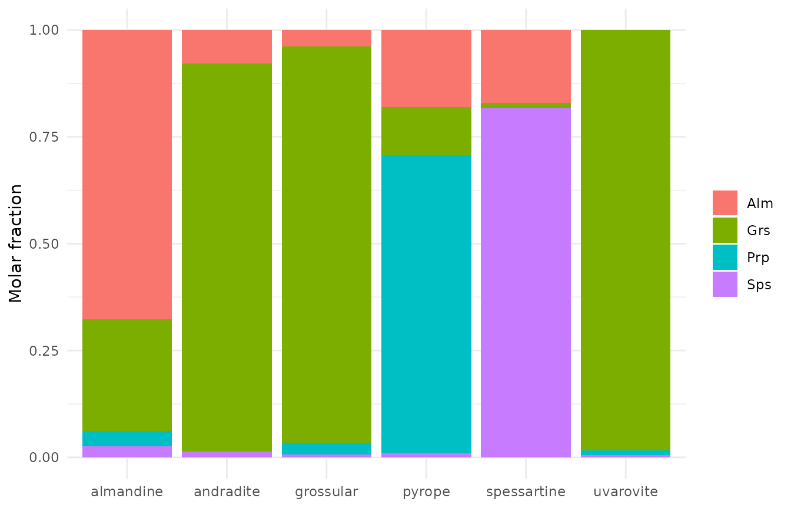
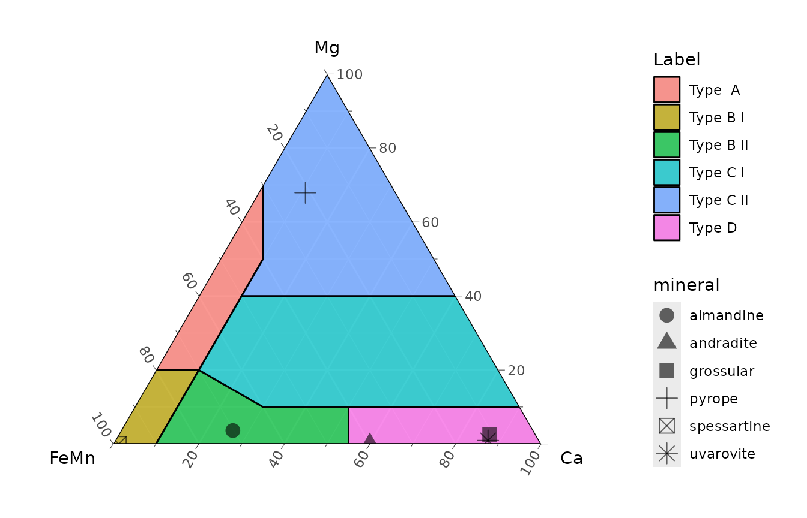
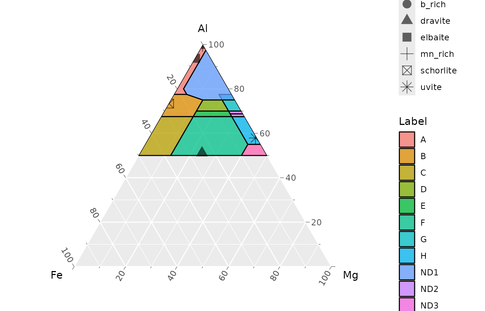

# Mineral formulae (APFU)

[`chemical_formula()`](https://gabertol.github.io/ztR/reference/chemical_formula.md)
converts oxide wt% (EPMA, SEM-EDS) into atoms per formula unit (APFU),
normalizing either to a fixed number of oxygens (`base = "anions"`) or
of cations (`base = "cations"`).

``` r

library(ztR)
library(tidyverse)
```

## Input

One row per analysis, an identifier column called `specimen` and one
column per oxide, named as in the oxide table of the package (`SiO2`,
`Al2O3`, `FeO`, `Fe2O3`, `H2O_plus`, …). The oxides must be the last
columns of the table, starting at `SiO2`. Missing oxides can be `NA`;
they are treated as zero.

The package ships three small example tables with textbook compositions
(Deer, Howie & Zussman):

``` r

read_ex <- function(file) {
  read.csv(system.file("extdata", file, package = "ztR")) %>%
    select(specimen, mineral, everything(), -X)
}

tourmaline <- read_ex("tourmaline_DHZ.csv")
garnet     <- read_ex("garnet_DHZ.csv")
epidote    <- read_ex("epidote_DHZ.csv")

garnet
#>   specimen     mineral  SiO2 TiO2 Al2O3 Cr2O3 Fe2O3   FeO   MnO   MgO   CaO
#> 1        1      pyrope 41.33 0.28 21.83  1.73  1.44  9.00  0.44 19.60  4.40
#> 2        2   almandine 36.70 0.75 21.40    NA    NA 29.90  1.14  0.90  9.02
#> 3        3 spessartine 36.34 0.10 20.25    NA  0.92  7.30 34.51    NA  0.44
#> 4        4   grossular 39.04 0.12 20.43    NA  3.29  1.81  0.34  0.73 34.29
#> 5        5   andradite 36.48 0.50  6.80    NA 21.94  3.33  0.56  0.00 30.22
#> 6        6   uvarovite 36.77   NA  8.36 13.72  5.85    NA  0.22  0.27 34.56
```

[`chemical_formula()`](https://gabertol.github.io/ztR/reference/chemical_formula.md)
returns `specimen` plus one column per cation (and the normalization
bases), so the result is joined back to the input by `specimen`.

## Tourmaline: 31 anions

``` r

tur <- tourmaline %>%
  select(specimen, mineral) %>%
  left_join(chemical_formula(tourmaline, oxigens = 31, cations = 16), by = "specimen")

tur %>% select(mineral, Si, Al, Fe, Fe3, Mg, Na, Ca)
#>     mineral       Si       Al          Fe       Fe3          Mg         Na
#> 1   dravite 6.080842 4.633893 0.973011956 1.2691460 2.181759396 0.50054707
#> 2     uvite 5.842633 5.131914 0.055709434 0.0000000 3.681637525 0.04095238
#> 3 schorlite 5.928376 6.454551 1.896319867 0.4311784 0.017994361 0.78567795
#> 4   elbaite 5.928888 7.779391 0.496371396 0.0000000 0.021877638 0.69553487
#> 5   mn_rich 5.854724 7.362553 0.019298232 0.0000000 0.002457209 0.84369268
#> 6    b_rich 4.909989 8.564199 0.006530162 0.0000000 0.000000000 0.40271377
#>            Ca
#> 1 0.482185007
#> 2 0.957434850
#> 3 0.003695026
#> 4 0.117052803
#> 5 0.031788032
#> 6 0.291142012
```

## Garnet: 24 oxygens

``` r

gt <- garnet %>%
  select(specimen, mineral) %>%
  left_join(chemical_formula(garnet, oxigens = 24, cations = 16), by = "specimen")

gt %>% select(mineral, Si, Al, Fe, Fe3, Mn, Mg, Ca)
#>       mineral       Si       Al        Fe       Fe3         Mn        Mg
#> 1      pyrope 5.948124 3.702747 1.0832111 0.1733138 0.05363555 4.2051279
#> 2   almandine 5.898086 4.053354 4.0185762 0.0000000 0.15517986 0.2156235
#> 3 spessartine 6.006392 3.944659 1.0090382 0.1271665 4.83124612 0.0000000
#> 4   grossular 5.977115 3.686429 0.2317482 0.4212439 0.04409062 0.1666146
#> 5   andradite 6.266296 1.376641 0.4783616 3.1517276 0.08147597 0.0000000
#> 6   uvarovite 5.999195 1.607538 0.0000000 0.7981991 0.03040237 0.0656707
#>           Ca
#> 1 0.67846105
#> 2 1.55313501
#> 3 0.07791823
#> 4 5.62479775
#> 5 5.56170768
#> 6 6.04130471
```

End-member proportions follow directly from the X-site cations:

``` r

gt %>%
  mutate(x_site = Fe + Mn + Mg + Ca,
         Alm = Fe / x_site, Sps = Mn / x_site, Prp = Mg / x_site, Grs = Ca / x_site) %>%
  select(mineral, Alm:Grs) %>%
  pivot_longer(Alm:Grs, names_to = "end_member", values_to = "fraction") %>%
  ggplot(aes(mineral, fraction, fill = end_member)) +
  geom_col() +
  labs(x = NULL, y = "Molar fraction", fill = NULL) +
  theme_minimal()
```



## Epidote: different oxygen bases per row

`oxigens` can be a vector with one value per row. Here the Fe-free
members are normalized to 12.5 oxygens and the rest to 13:

``` r

epidote %>%
  select(specimen, mineral) %>%
  left_join(chemical_formula(epidote, oxigens = c(12.5, 13, 12.5, 12.5, 12.5, 13), cations = 8),
            by = "specimen") %>%
  select(mineral, Si, Al, Fe3, Ca)
#>        mineral       Si       Al         Fe3        Ca
#> 1      zoisite 3.087089 2.916625 0.006820044 1.9039878
#> 2 clinozoisite 3.147901 2.984926 0.107301506 2.0304554
#> 3      epidote 2.934365 2.780901 0.486453903 1.9408238
#> 4      epidote 3.161394 1.621020 1.649536592 2.0180021
#> 5   piemontite 3.172913 2.205762 0.158234437 1.9932883
#> 6     allanite 3.227082 1.830098 0.675130514 0.9905941
```

## Ternary diagrams

Classification diagrams can be drawn with the companion package
[ggarnet](https://github.com/gabertol/ggarnet), built on ggtern. The
chunk below only runs when both are installed.

``` r

library(ggtern)
library(ggarnet)

ggarnet_fe_mn() +
  geom_point(data = gt, aes(x = Fe3 + Fe + Mn, z = Ca, y = Mg, shape = mineral), size = 4, alpha = 0.6)
#> Warning: `aes_string()` was deprecated in ggplot2 3.0.0.
#> ℹ Please use tidy evaluation idioms with `aes()`.
#> ℹ See also `vignette("ggplot2-in-packages")` for more information.
#> ℹ The deprecated feature was likely used in the ggarnet package.
#>   Please report the issue to the authors.
#> This warning is displayed once per session.
#> Call `lifecycle::last_lifecycle_warnings()` to see where this warning was
#> generated.
#> Warning: Using `size` aesthetic for lines was deprecated in ggplot2 3.4.0.
#> ℹ Please use `linewidth` instead.
#> ℹ The deprecated feature was likely used in the ggarnet package.
#>   Please report the issue to the authors.
#> This warning is displayed once per session.
#> Call `lifecycle::last_lifecycle_warnings()` to see where this warning was
#> generated.
#> Warning in ggplot2::geom_polygon(data = grad, alpha = 0.75, size = 0.5, :
#> Ignoring unknown aesthetics: z
#> Warning in geom_point(data = gt, aes(x = Fe3 + Fe + Mn, z = Ca, y = Mg, :
#> Ignoring unknown aesthetics: z
```



``` r


ggarnet_tourmaline() +
  geom_point(data = tur, aes(x = Fe3 + Fe, y = Al, z = Mg, shape = mineral), size = 4, alpha = 0.6)
#> Warning in ggplot2::geom_polygon(data = grad, alpha = 0.75, size = 0.5, :
#> Ignoring unknown aesthetics: z
#> Warning in geom_point(data = tur, aes(x = Fe3 + Fe, y = Al, z = Mg, shape =
#> mineral), : Ignoring unknown aesthetics: z
```


