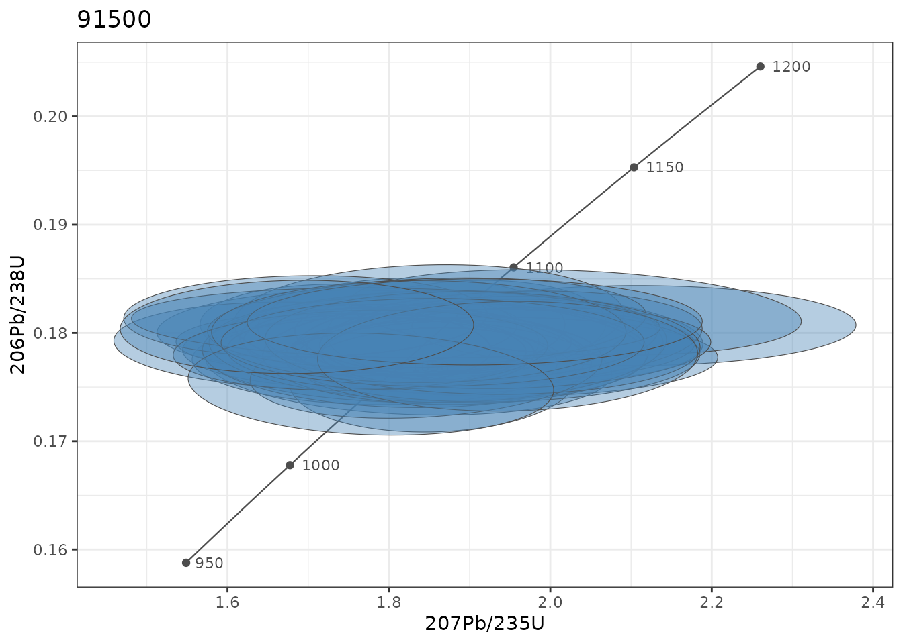
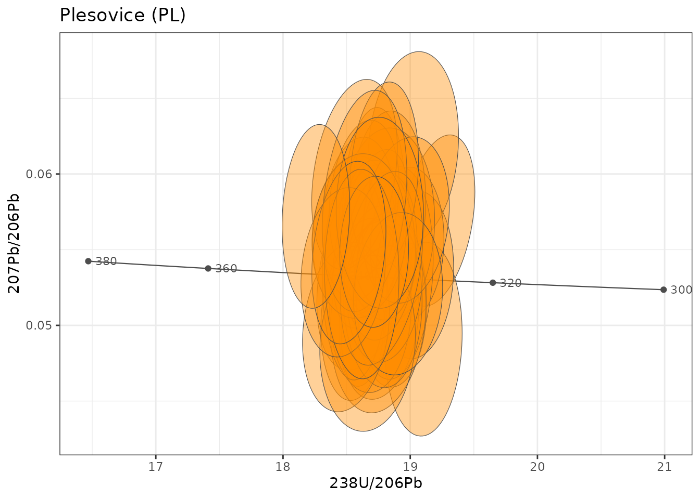
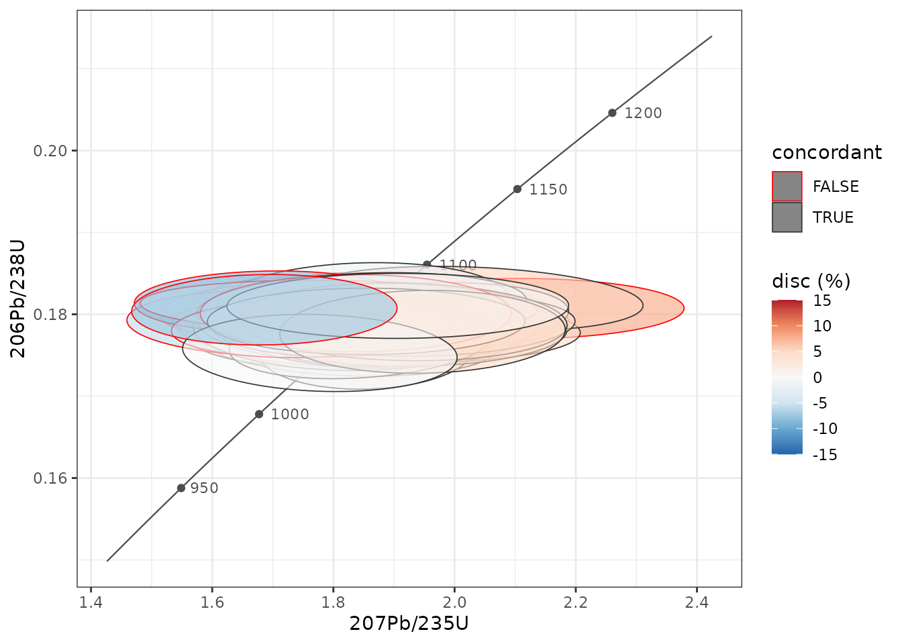

# U-Pb geochronology and concordia diagrams

ztR computes single-grain U-Pb ages with IsoplotR behind a tidy
interface, and draws concordia diagrams as ordinary ggplot2 layers. This
article uses the reference zircons shipped with the package (91500,
Plešovice, FC-1 and PCIGR-1).

The age calculations need IsoplotR (`install.packages("IsoplotR")`); the
concordia layers do not.

``` r

library(ztR)
library(tidyverse)

zircons <- read_csv(system.file("extdata", "stds_zircon.csv", package = "ztR"),
                    show_col_types = FALSE, name_repair = "unique_quiet") %>%
  rename_with(~ .x %>%
                str_replace_all("_mean|_ppm", "") %>%
                str_replace_all("_2se_int", "_2s")) %>%
  mutate(sample = recode(sample, "91500-G" = "91500", "FC1" = "FC-1")) %>%
  mutate(spot = row_number(), .by = sample)

# a manageable subset: 40 analyses per reference material
zr40 <- zircons %>% filter(spot <= 40)
```

## 1. Single-grain ages

[`use_isoplotr()`](https://gabertol.github.io/ztR/reference/use_isoplotr.md)
needs the three ratios with their 2σ absolute uncertainties. The error
correlations `rho_206pb_238u_v_207pb_235u` (Wetherill) and
`rho_207pb_206pb_v_238u_206pb` (Tera-Wasserburg) are used when present;
otherwise IsoplotR infers them from the redundancy of the three ratios.

``` r

ages <- use_isoplotr(zr40, legacy = FALSE)
#> 18 row(s) with missing or non-positive ratios/errors: ages set to NA.

ages %>%
  select(sample, age_68, age_68_2s, age_76, age_76_2s, age_conc, age_conc_2s, p_conc, disc_c) %>%
  head()
#> # A tibble: 6 × 9
#>   sample age_68 age_68_2s age_76 age_76_2s age_conc age_conc_2s p_conc disc_c
#>   <chr>   <dbl>     <dbl>  <dbl>     <dbl>    <dbl>       <dbl>  <dbl>  <dbl>
#> 1 91500   1067.        NA   954.        NA    1063.          NA     NA -4.20 
#> 2 91500   1071.        NA  1282.        NA    1074.          NA     NA  8.48 
#> 3 91500   1069.        NA  1120.        NA    1070.          NA     NA  1.98 
#> 4 91500   1050.        NA  1061.        NA    1051.          NA     NA  0.417
#> 5 91500   1053.        NA  1020.        NA    1052.          NA     NA -1.25 
#> 6 91500   1069.        NA   942.        NA    1067.          NA     NA -4.94
```

Every uncertainty column ending in `_2s` is 2σ. `disc_c` is the
concordia-distance discordance (%) of Vermeesch (2021); other
definitions are available through `discordance` (`"r"`, `"t"`, `"a"`,
`"sk"`, see
[`IsoplotR::discfilter()`](https://rdrr.io/pkg/IsoplotR/man/discfilter.html)).

### Speed

The single-grain concordia age is what makes IsoplotR slow (tens of
milliseconds per grain). When only the 7/5, 6/8 and 7/6 ages are needed,
`concordia = FALSE` is about 20 times faster:

``` r

all_ages <- use_isoplotr(zircons, concordia = FALSE, legacy = FALSE)
#> 19 row(s) with missing or non-positive ratios/errors: ages set to NA.
nrow(all_ages)
#> [1] 3099
```

## 2. Comparison with Iolite

The table also carries the ages exported by Iolite (`pb206_u238_age`,
`pb207_pb206_age`, …), which gives a direct check of the calculation:

``` r

all_ages %>%
  transmute(sample,
            `206Pb/238U` = age_68 - pb206_u238_age,
            `207Pb/235U` = age_75 - pb207_u235_age) %>%
  pivot_longer(-sample, names_to = "system", values_to = "difference") %>%
  group_by(sample, system) %>%
  summarise(median_Ma = median(difference, na.rm = TRUE),
            p95_abs_Ma = quantile(abs(difference), 0.95, na.rm = TRUE),
            .groups = "drop")
#> # A tibble: 8 × 4
#>   sample system     median_Ma p95_abs_Ma
#>   <chr>  <chr>          <dbl>      <dbl>
#> 1 91500  206Pb/238U     2.99      18.1  
#> 2 91500  207Pb/235U    29.9       71.0  
#> 3 FC-1   206Pb/238U     2.28      10.0  
#> 4 FC-1   207Pb/235U    11.0       32.7  
#> 5 PCIGR1 206Pb/238U     0.371      0.510
#> 6 PCIGR1 207Pb/235U    31.7       42.1  
#> 7 PL     206Pb/238U     0.228      1.30 
#> 8 PL     207Pb/235U     3.66       8.84
```

The 206Pb/238U ages agree within a few tenths of a percent (median
offset of 3 Ma at 1065 Ma for 91500, 0.2 Ma for Plešovice). The
207Pb/235U ages are systematically older in IsoplotR, by up to ~3% in
the low-Pb reference materials. The most likely reason is that Iolite
reports the mean of the ages of each integration, whereas IsoplotR
computes the age of the mean ratio; with noisy 207Pb signals the two
diverge. The 206Pb/238U uncertainties are identical:

``` r

all_ages %>%
  summarise(ratio_2s = median(age_68_2s / pb206_u238_age_2s, na.rm = TRUE), .by = sample)
#> # A tibble: 4 × 2
#>   sample ratio_2s
#>   <chr>     <dbl>
#> 1 91500        NA
#> 2 PCIGR1       NA
#> 3 PL           NA
#> 4 FC-1         NA
```

## 3. Median ages of the reference materials

``` r

ages %>%
  summarise(n = n(),
            concordia_age = median(age_conc, na.rm = TRUE),
            age_68 = median(age_68, na.rm = TRUE),
            .by = sample)
#> # A tibble: 4 × 4
#>   sample     n concordia_age age_68
#>   <chr>  <int>         <dbl>  <dbl>
#> 1 91500     40         1062.  1061.
#> 2 PCIGR1    40         1060.  1065.
#> 3 PL        40          335.   335.
#> 4 FC-1      40         1096.  1096.
```

Reference values: 91500 ≈ 1065 Ma (Wiedenbeck et al. 1995), Plešovice ≈
337 Ma (Sláma et al. 2008), FC-1 ≈ 1099 Ma (Paces & Miller 1993).

## 4. Concordia diagrams

[`geom_concordia()`](https://gabertol.github.io/ztR/reference/geom_concordia.md)
draws one error ellipse per row from `x`, `y`, `sigma_x`, `sigma_y` and
`rho`. By default the ellipse is the 95% confidence region;
`sigma_level = 2` tells the layer that the uncertainties mapped to
`sigma_x`/`sigma_y` are 2σ.
[`geom_concordia_line()`](https://gabertol.github.io/ztR/reference/geom_concordia_line.md)
adds the concordia curve with age markers.

### Wetherill

``` r

zr40 %>%
  filter(sample == "91500") %>%
  ggplot(aes(x = pb207_u235, y = pb206_u238,
             sigma_x = pb207_u235_2s, sigma_y = pb206_u238_2s,
             rho = rho_206pb_238u_v_207pb_235u)) +
  geom_concordia_line(age_range = c(950, 1200), ticks = seq(950, 1200, 50)) +
  geom_concordia(sigma_level = 2, alpha = 0.4, fill = "steelblue", colour = "grey30",
                 linewidth = 0.2) +
  labs(title = "91500", x = "207Pb/235U", y = "206Pb/238U") +
  theme_bw()
```



The concordia line is drawn over `age_range`, which also sets how far
the plot extends; choose it around the ages of the data. Because the
line does not know about facets, draw one diagram per sample (or per age
window) rather than faceting samples of very different ages.

### Tera-Wasserburg

Build 238U/206Pb and its uncertainty from 206Pb/238U, and use the
Tera-Wasserburg correlation:

``` r

zr40 %>%
  filter(sample == "PL") %>%
  mutate(u238_pb206 = 1 / pb206_u238,
         u238_pb206_2s = pb206_u238_2s / pb206_u238^2) %>%
  ggplot(aes(x = u238_pb206, y = pb207_pb206,
             sigma_x = u238_pb206_2s, sigma_y = pb207_pb206_2s,
             rho = rho_207pb_206pb_v_238u_206pb)) +
  geom_concordia_line("tw", age_range = c(300, 380), ticks = seq(300, 380, 20)) +
  geom_concordia(sigma_level = 2, alpha = 0.4, fill = "darkorange", colour = "grey30",
                 linewidth = 0.2) +
  labs(title = "Plesovice (PL)", x = "238U/206Pb", y = "207Pb/206Pb") +
  theme_bw()
```



### Colouring by discordance

Any aesthetic can be mapped. Here the ellipses are filled by the
concordia-distance discordance, with IsoplotR’s default cutoff (−2% to
+5.8%) marked by the outline:

``` r

ages %>%
  filter(sample == "91500") %>%
  mutate(concordant = between(disc_c, -2, 5.8)) %>%
  ggplot(aes(x = pb207_u235, y = pb206_u238,
             sigma_x = pb207_u235_2s, sigma_y = pb206_u238_2s,
             rho = rho_206pb_238u_v_207pb_235u)) +
  geom_concordia_line(age_range = c(900, 1250), ticks = seq(950, 1200, 50)) +
  geom_concordia(aes(fill = disc_c, colour = concordant), sigma_level = 2,
                 alpha = 0.6, linewidth = 0.3) +
  scale_fill_distiller(palette = "RdBu", limits = c(-15, 15), oob = scales::squish) +
  scale_colour_manual(values = c(`TRUE` = "grey20", `FALSE` = "red")) +
  labs(x = "207Pb/235U", y = "206Pb/238U", fill = "disc (%)") +
  theme_bw()
```



## 5. Notes for older code

- [`use_isoplotr()`](https://gabertol.github.io/ztR/reference/use_isoplotr.md)
  and
  [`tidy_isoplotr()`](https://gabertol.github.io/ztR/reference/use_isoplotr.md)
  still return the old columns by default (`legacy = TRUE`). **The old
  `s_2_*` columns hold 1σ values** (they always did); use the `*_2s`
  columns instead. Before version 0.0.0.9001 the data were read in the
  wrong IsoplotR format, so old 207/206 ages, concordia ages and
  discordances should be recomputed.
- [`add_concordia_line()`](https://gabertol.github.io/ztR/reference/add_concordia_line.md)
  still works, but its axes are transposed (x = 206Pb/238U, y =
  207Pb/235U). Use
  [`geom_concordia_line()`](https://gabertol.github.io/ztR/reference/geom_concordia_line.md)
  for new plots.
- [`geom_concordia()`](https://gabertol.github.io/ztR/reference/geom_concordia.md)
  now draws 95% ellipses by default; `level = NULL` reproduces the old
  1σ ellipses.
