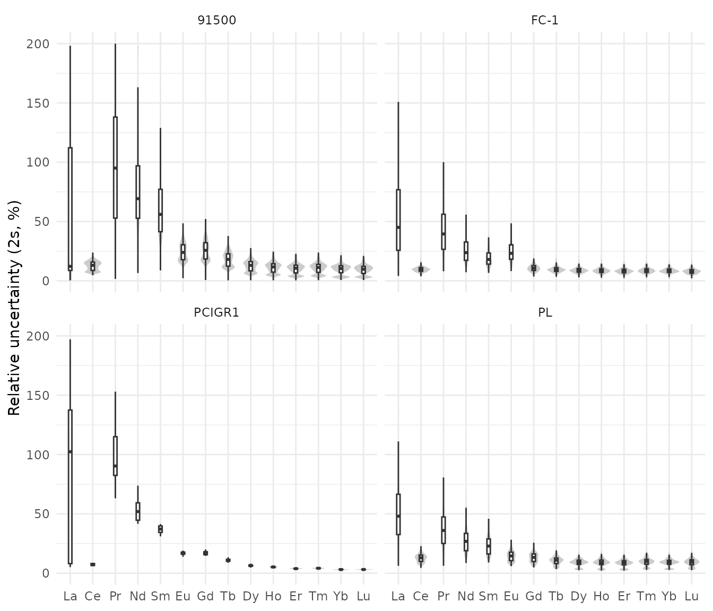
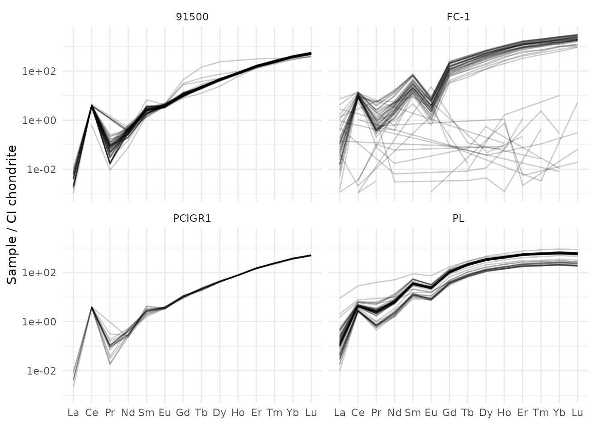
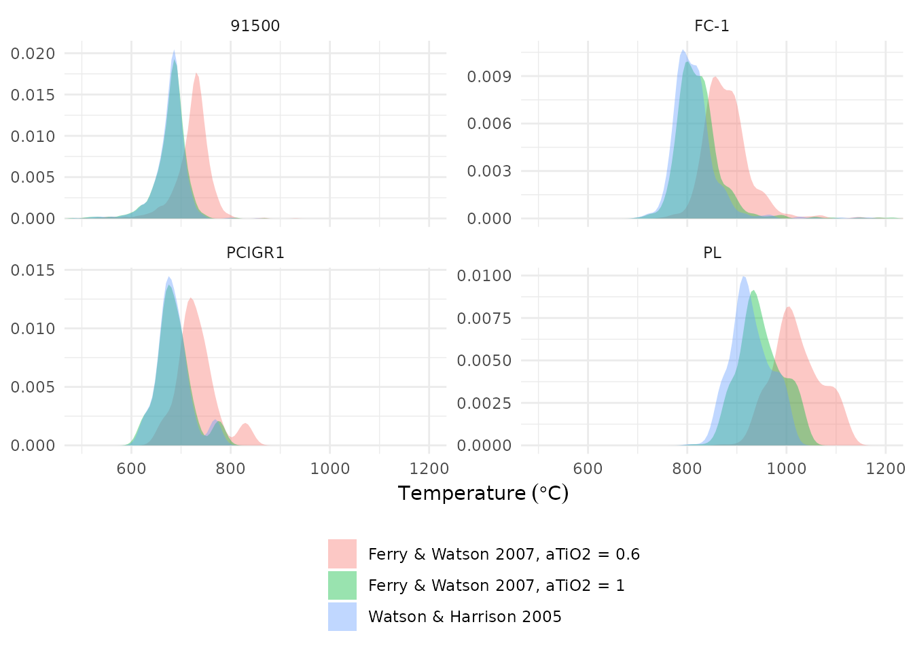
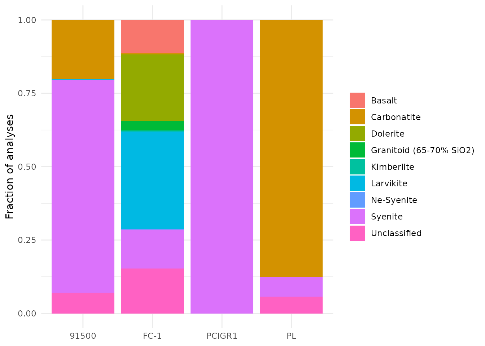

# Zircon trace-element geochemistry

This article walks through the trace-element tools of ztR using the
reference zircons shipped with the package: data quality, chondrite
normalization, ratios and proxies, Ti-in-zircon thermometry,
oxybarometry, source-rock classification and parent-rock estimates.

``` r

library(ztR)
library(tidyverse)

zircons <- read_csv(system.file("extdata", "stds_zircon.csv", package = "ztR"),
                    show_col_types = FALSE, name_repair = "unique_quiet") %>%
  rename_with(~ .x %>%
                str_replace_all("_mean|_ppm", "") %>%
                str_replace_all("_2se_int", "_2s")) %>%
  mutate(sample = recode(sample, "91500-G" = "91500", "FC1" = "FC-1")) %>%
  mutate(spot = row_number(), .by = sample)

ree <- c("la139", "ce140", "pr141", "nd146", "sm147", "eu153", "gd157", "tb159",
         "dy163", "ho165", "er166", "tm169", "yb172", "lu175")
```

## 1. Analytical uncertainty

Before interpreting anything, check how precise each element is. The
relative 2σ uncertainty of the REE per reference material:

``` r

zircons %>%
  select(sample, spot, all_of(ree), all_of(paste0(ree, "_2s"))) %>%
  pivot_longer(-c(sample, spot)) %>%
  mutate(kind = if_else(str_detect(name, "_2s$"), "s2", "value"),
         name = str_remove(name, "_2s$")) %>%
  pivot_wider(names_from = kind, values_from = value) %>%
  mutate(error_pct = 100 * s2 / value,
         element = fct_inorder(str_to_title(str_remove(name, "[0-9]+")))) %>%
  filter(error_pct > 0, error_pct < 200) %>%
  ggplot(aes(element, error_pct)) +
  geom_violin(fill = "grey80", colour = NA) +
  geom_boxplot(width = 0.15, outlier.shape = NA) +
  facet_wrap(~ sample) +
  labs(x = NULL, y = "Relative uncertainty (2s, %)") +
  theme_minimal()
```



The LREE (La, Pr) are close to detection limit in zircon and carry very
large uncertainties; ratios using them (e.g. Ce/Ce\*) should be read
with care.

## 2. Chondrite normalization

[`normalize()`](https://gabertol.github.io/ztR/reference/normalize.md)
divides each element by the CI chondrite of McDonough & Sun (1995) and
adds the normalized columns with the suffix `_N`. Other reference tables
can be chosen with `database` (e.g. `"taylor_mcclennan_1985.csv"` for
the upper continental crust).

``` r

zn <- normalize(zircons, element_vector = c(y89, la139:lu175))
zn %>% select(sample, la139_N:lu175_N) %>% head(3)
#> # A tibble: 3 × 15
#>   sample  la139_N ce140_N pr141_N nd146_N sm147_N eu153_N gd157_N tb159_N
#>   <chr>     <dbl>   <dbl>   <dbl>   <dbl>   <dbl>   <dbl>   <dbl>   <dbl>
#> 1 91500   0.00166    4.06  0.0934   0.482    2.32    3.75    10.7    20.8
#> 2 91500  NA          3.96  0.0820   0.281    3.90    3.65    13.1    22.7
#> 3 91500   0.00704    4.12  0.131    0.623    3.37    4.84    11.2    23.9
#> # ℹ 6 more variables: dy163_N <dbl>, ho165_N <dbl>, er166_N <dbl>,
#> #   tm169_N <dbl>, yb172_N <dbl>, lu175_N <dbl>
```

A spider diagram of the normalized REE:

``` r

zn %>%
  filter(spot <= 60) %>%
  select(sample, spot, paste0(ree, "_N")) %>%
  pivot_longer(-c(sample, spot), values_to = "value") %>%
  filter(value >= 1e-3) %>%          # drop values at or below detection limit
  mutate(element = fct_inorder(str_to_title(str_remove(name, "[0-9]+_N")))) %>%
  ggplot(aes(element, value, group = spot)) +
  geom_line(alpha = 0.2) +
  scale_y_log10() +
  facet_wrap(~ sample) +
  labs(x = NULL, y = "Sample / CI chondrite") +
  theme_minimal()
```



## 3. Ratios and proxies

[`ratio_calculator()`](https://gabertol.github.io/ztR/reference/ratio_calculator.md)
adds the most common zircon ratios in one step. It needs the normalized
REE plus the raw concentrations of Ce, U, Ti, Hf and Y (ppm) and a
crystallization age in `best_age` (Ma), used to correct U for decay in
the oxybarometer.

Use `legacy = FALSE` for columns named after what they compute (see
[`?ratio_calculator`](https://gabertol.github.io/ztR/reference/ratio_calculator.md)).

``` r

zr <- zn %>%
  ratio_calculator(legacy = FALSE)

zr %>%
  group_by(sample) %>%
  summarise(across(c(eu_eu, ce_ce, dy_yb, yb_gd, lree_hree, hf_y, fmq, ti_temp),
                   ~ median(.x, na.rm = TRUE)))
#> # A tibble: 4 × 9
#>   sample  eu_eu   ce_ce dy_yb yb_gd lree_hree  hf_y   fmq ti_temp
#>   <chr>   <dbl>   <dbl> <dbl> <dbl>     <dbl> <dbl> <dbl>   <dbl>
#> 1 91500  0.783  1849.   0.113 37.2    0.00486 42.9  -1.48    683.
#> 2 FC-1   0.0544   47.2  0.224 16.0    0.00544  8.63 -2.09    802.
#> 3 PCIGR1 0.704   229.   0.116 35.8    0.00501 51.2  -1.44    680.
#> 4 PL     0.412     9.46 0.536  6.17   0.0144  26.1  -5.82    920.
```

| Column | Meaning |
|----|----|
| `ce_nd` | Ce_N / Nd_N |
| `dy_yb` | Dy_N / Yb_N |
| `yb_gd` | Yb_N / Gd_N |
| `lree_hree` | (La–Sm)\_N / (Gd–Lu)\_N |
| `hf_y` | Hf / Y (ppm) |
| `sumREE` | sum of the normalized REE |
| `eu_eu`, `ce_ce` | Eu/Eu\* and Ce/Ce\* ([`anomaly()`](https://gabertol.github.io/ztR/reference/anomaly.md)) |
| `crust` | crustal thickness from Eu/Eu\* ([`crustal_thickness()`](https://gabertol.github.io/ztR/reference/crustal_thickness.md)) |
| `fmq` | ΔFMQ, Loucks et al. (2020) ([`FMQ()`](https://gabertol.github.io/ztR/reference/FMQ.md)) |
| `ti_temp` | Ti-in-zircon temperature, °C ([`zircon_ti_t()`](https://gabertol.github.io/ztR/reference/zircon_ti_t.md)) |

## 4. Ti-in-zircon thermometry

[`zircon_ti_t()`](https://gabertol.github.io/ztR/reference/zircon_ti_t.md)
implements several calibrations. The default `"watson"` is Watson &
Harrison (2005); `"ferry_watson2007"` accounts for the activities of
SiO2 and TiO2, which matters when rutile is absent (aTiO2 \< 1).

``` r

zircons %>%
  filter(ti49 > 0) %>%
  mutate(
    `Watson & Harrison 2005` = zircon_ti_t(ti_ppm = ti49),
    `Ferry & Watson 2007, aTiO2 = 1` = zircon_ti_t(ti_ppm = ti49, equation = "ferry_watson2007"),
    `Ferry & Watson 2007, aTiO2 = 0.6` = zircon_ti_t(ti_ppm = ti49, equation = "ferry_watson2007",
                                                      aTiO2 = 0.6)
  ) %>%
  pivot_longer(starts_with(c("Watson", "Ferry")), names_to = "calibration", values_to = "T_C") %>%
  ggplot(aes(T_C, fill = calibration)) +
  geom_density(alpha = 0.4, colour = NA) +
  facet_wrap(~ sample, scales = "free_y") +
  coord_cartesian(xlim = c(500, 1200)) +
  labs(x = expression(Temperature~(degree*C)), y = NULL, fill = NULL) +
  theme_minimal() +
  theme(legend.position = "bottom", legend.direction = "vertical")
```



The pressure-dependent calibration of Crisp et al. (2023) is available
as `equation = "crisp"` (with `pressure` in GPa), but its implementation
still has to be checked against the paper.

## 5. Source-rock classification

[`classify_rock_long()`](https://gabertol.github.io/ztR/reference/classify_rock_long.md)
applies the CART tree of Belousova et al. (2002). It needs Lu, U, Ta and
Nb in ppm, Hf in **wt%**, Ce/Ce\* and Th/U.

``` r

zr %>%
  mutate(hf = ppm_to_percent(hf177),
         th_u = approx_th / approx_u) %>%
  classify_rock_long() %>%
  count(sample, classification) %>%
  group_by(sample) %>%
  mutate(fraction = n / sum(n)) %>%
  ggplot(aes(sample, fraction, fill = classification)) +
  geom_col() +
  labs(x = NULL, y = "Fraction of analyses", fill = NULL) +
  theme_minimal()
```



**Caveat.** The reference zircons are not all assigned to their known
host rocks: Plešovice, from a potassic granulite, falls mostly in
“Carbonatite”. The implementation of the tree (thresholds, units and
branch order) is still being checked against Belousova et al. (2002), so
treat these classifications as provisional.

[`classify_rock_long_no_ce()`](https://gabertol.github.io/ztR/reference/classify_rock_long.md)
skips Ce/Ce\* (useful when La and Pr are below detection) and
[`classify_rock_short()`](https://gabertol.github.io/ztR/reference/classify_rock_long.md)
uses the shorter tree based on Lu, U, Hf, Y and Yb.

## 6. Parent-rock composition and crustal thickness

[`WR_calculator()`](https://gabertol.github.io/ztR/reference/WR_calculator.md)
estimates the trace-element content of the parent melt with the
zircon/melt partition coefficients of Chapman et al. (2016). The result
can be normalized again and fed to the La/Yb crustal-thickness proxy of
Profeta et al. (2015):

``` r

wr <- zircons %>%
  filter(sample == "PL") %>%
  WR_calculator(element_vector = c(y89, nb93, la139:lu175)) %>%
  normalize(tag = "_WR", element_vector = c(y89_WR, nb93_WR, la139_WR:lu175_WR)) %>%
  WR_crustal_thickness()

wr %>%
  summarise(la_yb_N = median(la139_WR_N / yb172_WR_N, na.rm = TRUE),
            thickness_km = median(WR_crust, na.rm = TRUE))
#> # A tibble: 1 × 2
#>   la_yb_N thickness_km
#>     <dbl>        <dbl>
#> 1    33.1         74.9
```
